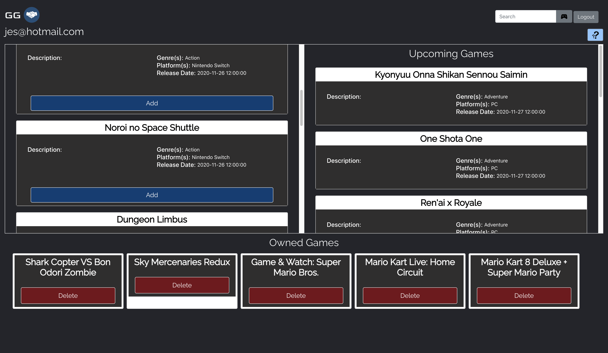
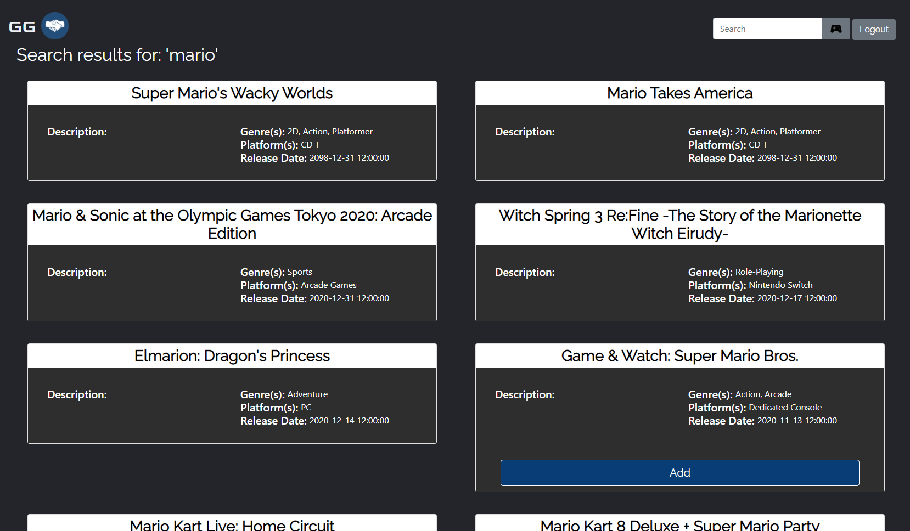

<!-- PROJECT LOGO -->
<br />
<p align="center">
  <a href="https://github.com/LouisYS-Carleton/Game-Helper">
    
  </a>

  <h3 align="center">Good Games</h3>

  <p align="center">
    <br />
    <a href="https://github.com/LouisYS-Carleton/Game-Helper"><strong>Explore the docs »</strong></a>
    <br />
    <br />
    ·
    <a href="https://github.com/LouisYS-Carleton/Game-Helper/issues">Report Bug</a>
    ·
    <a href="https://github.com/LouisYS-Carleton/Game-Helper/issues">Request Feature</a>
  </p>
</p>

<!-- TABLE OF CONTENTS -->
<details open="open">
  <summary><h2 style="display: inline-block">Table of Contents</h2></summary>
  <ol>
    <li>
      <a href="#about-the-project">About The Project</a>
      <ul>
        <li><a href="#built-with">Built With</a></li>
      </ul>
    </li>
    <li>
      <a href="#getting-started">Getting Started</a>
      <ul>
        <li><a href="#prerequisites">Prerequisites</a></li>
        <li><a href="#installation">Installation</a></li>
      </ul>
    </li>
    <li><a href="#usage">Usage</a></li>
    <li><a href="#roadmap">Roadmap</a></li>
    <li><a href="#contributing">Contributing</a></li>
    <li><a href="#license">License</a></li>
    <li><a href="#contact">Contact</a></li>
  </ol>
</details>

<!-- ABOUT THE PROJECT -->

## About The Project



:link: [Go to Good Games](https://game-helper.herokuapp.com/)

Good Games is an app made for gamers, by gamers. It was created to help video game enthusiasts keep track of their current game collection, view upcoming games, and even search game titles.



`LouisYS-Carleton`,`angelicamapeso` , `NatallieMbayo`, `Game-Helper`, `LouisYSCarleton@gmail.com`, `GOOD GAMES`

<!-- BUILT WITH -->

### Built With

#### Front-end

- [Intro.js](https://introjs.com/)
- [Express-Handlebars](https://www.npmjs.com/package/express-handlebars)
- [Bootstrap](https://getbootstrap.com/)

#### Back-end

- [Axios](https://www.npmjs.com/package/axios)
- [Bcrypt](https://www.npmjs.com/package/bcrypt)
- [Express](https://expressjs.com/)
  - [Express-session](https://www.npmjs.com/package/express-session)
- [Sequelize](https://sequelize.org/master/)
- [Passport](http://www.passportjs.org/)
  - [Passport-local](http://www.passportjs.org/packages/passport-local/)
- [Moment.js](https://momentjs.com/)

<!-- GETTING STARTED -->

## Getting Started

To get a local copy up and running follow these simple steps.

### Prerequisites

This is an example of how to list things you need to use the software and how to install them.

- npm
  ```sh
  npm install
  ```

### Installation

1. Clone the repo
   ```sh
   git clone https://github.com/LouisYS-Carleton/Game-Helper
   ```
2. Install NPM packages
   ```sh
   npm install
   ```

<!-- USAGE EXAMPLES -->

## Usage

Good Games is an application made for both professional and casual gamers. Some uses for our application are:

- Organizing your current games library
- Viewing upcoming games
- Viewing currently released games
- Collecting info about unique games

<!-- ROADMAP -->

## Roadmap

See the [open issues](https://github.com/LouisYS-Carleton/Game-Helper/issues) for a list of proposed features (and known issues).

<!-- CONTRIBUTING -->

## Contributing

If you wish to contribute to our project please use the instructions below. Any additions will be **greatly appreciated**.

1. Fork the Project
2. Create your Feature Branch (`git checkout -b feature/AmazingFeature`)
3. Commit your Changes (`git commit -m 'Add some AmazingFeature'`)
4. Push to the Branch (`git push origin feature/AmazingFeature`)
5. Open a Pull Request

<!-- LICENSE -->

## License

Distributed under the MIT License. See `LICENSE` for more information.

<!-- CONTACT -->

## Contact

- Louis YS - LouisYSCarleton@gmail.com
- Angelica Mapeso - angelica.mapeso@gmail.com
- Natalie M'bayo - https://www.linkedin.com/in/natallie-m%E2%80%99bayo-4476091a5/

Project Link: [https://github.com/LouisYS-Carleton/Game-Helper](https://github.com/LouisYS-Carleton/Game-Helper/)
